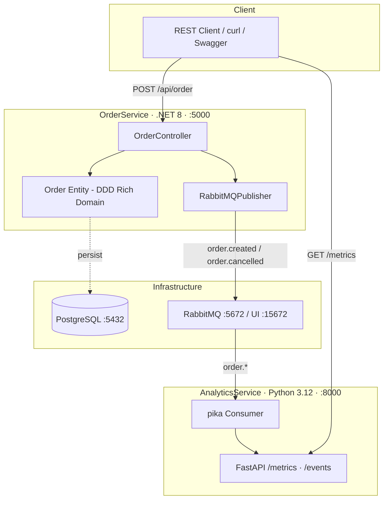

# Master-Project — Polyglot Microservices Ecosystem

> **Stack:** .NET 8 (OrderService) · Python 3.12 (AnalyticsService) · RabbitMQ · PostgreSQL · Docker Compose

---

## Architecture Overview



### Event Flow

```
POST /api/order
    └─► OrderController
            └─► Order.Create() + Order.Confirm()   [DDD Rich Domain]
                    └─► RabbitMQPublisher.PublishAsync("order.created", payload)
                                └─► RabbitMQ [topic exchange: orders.exchange]
                                        └─► queue: analytics.orders
                                                └─► AnalyticsService consumer
                                                        └─► handle_order_created()
                                                                └─► GET /metrics  (live update)
```

---

## Services

| Service            | Tech            | Port       | Responsibility                          |
|--------------------|-----------------|------------|-----------------------------------------|
| `order-service`    | .NET 8 / ASP.NET Core | 5000 | Order lifecycle, DDD domain model, event publishing |
| `analytics-service`| Python 3.12 / FastAPI | 8000 | Event consumption, real-time metrics    |
| `postgres`         | PostgreSQL 16   | 5432       | Persistent order storage                |
| `rabbitmq`         | RabbitMQ 3.13   | 5672/15672 | Async messaging backbone                |

---

## Quick Start

```bash
# Clone e inicie tudo
git clone <repo-url>
cd Master-Project
docker compose up --build -d

# Acompanhe os logs
docker compose logs -f

# Crie um pedido
curl -X POST http://localhost:5000/api/order \
  -H "Content-Type: application/json" \
  -d '{
    "customerId": "user-123",
    "items": [
      { "product": "Notebook Dell", "quantity": 1, "unitPrice": 4500.00 },
      { "product": "Mouse Logitech", "quantity": 2, "unitPrice": 149.90 }
    ]
  }'

# Veja as métricas no AnalyticsService
curl http://localhost:8000/metrics

# Veja os eventos recentes
curl http://localhost:8000/events/recent

# RabbitMQ Management UI
open http://localhost:15672  # guest / guest

# Swagger do OrderService
open http://localhost:5000/swagger
```

---

## Domain Design (DDD)

- **`Order`** — Aggregate Root. Expõe métodos `Create()`, `AddItem()`, `Confirm()`, `Cancel()`. Estado interno protegido.
- **`OrderItem`** — Value Object dentro do aggregate. Criado via factory method.
- **`OrderStatus`** — Value Object imutável (Pending → Confirmed → Shipped / Cancelled).
- **Invariants** enforced internamente: não é possível confirmar pedido vazio, nem cancelar pedido enviado.

---

## CI/CD

GitHub Actions em `.github/workflows/ci.yml`:
- `dotnet test` no push para `main`/`develop`
- `pytest` no push para `main`/`develop`
- Docker build check após ambos os testes passarem

---

## Project Structure

```
Master-Project/
├── docker-compose.yml
├── README.md
├── .github/
│   └── workflows/
│       └── ci.yml
├── order-service-dotnet/
│   ├── Order.cs                  # DDD Rich Domain Entity
│   ├── OrderController.cs        # REST API Controller
│   ├── RabbitMQPublisher.cs      # Event Publisher
│   ├── Program.cs                # ASP.NET Core host
│   ├── OrderService.csproj
│   └── Dockerfile
└── analytics-service-python/
    ├── main.py                   # FastAPI + pika consumer
    ├── requirements.txt
    └── Dockerfile
```
