# polyglot-microservices-ecosystem

> Production-grade cloud-native platform: .NET 8 + Python 3.12 + Kubernetes + AWS Terraform + AI/LLM pipeline.

[](https://github.com/marcosantcs/polyglot-microservices-ecosystem/actions)


## Architecture — 5 Phases

```mermaid
graph TB
    subgraph CI["CI/CD — GitHub Actions"]
        J1[build] --> J2[test] --> J3[validate]
    end

    subgraph P1["Phase 1 — Core Ecosystem"]
        OS[order-service .NET 8<br/>DDD + Aggregate Root]
        AS[analytics-service Python<br/>FastAPI + pika]
        RMQ[RabbitMQ<br/>Topic Exchange + DLQ]
        PG[(PostgreSQL)]
        OS -->|publishes events| RMQ
        RMQ -->|consumes| AS
        OS --> PG
    end

    subgraph P2["Phase 2 — Testing + AI"]
        TEST[34 Automated Tests<br/>xUnit 14 + pytest 13 + AI 7]
        AI[ai-service Python<br/>OpenAI + PDF Q&A]
    end

    subgraph P3["Phase 3 — Observability"]
        PROM[Prometheus]
        GRAF[Grafana Dashboards]
        PROM --> GRAF
    end

    subgraph P4["Phase 4 — Kubernetes"]
        NS[Namespace: microservices]
        HPA[HPA auto-scale 2→10 pods]
        KOS[order-service pod]
        KAS[analytics-service pod]
        NS --> HPA --> KOS
        NS --> KAS
    end

    subgraph P5["Phase 5 — AWS + Terraform"]
        VPC[VPC 10.0.0.0/16]
        ALB[Application Load Balancer]
        ECS[ECS Fargate Cluster]
        RDS[(RDS PostgreSQL 15.4)]
        ECR[ECR Repositories]
        NAT[NAT Gateway]
        VPC --> ALB --> ECS
        VPC --> RDS
        ECS --> ECR
        VPC --> NAT
    end
```



## Tech Stack

| Layer | Technology |
|---|---|
| **Backend** | .NET 8 (C#), Python 3.12 |
| **Architecture** | DDD, Aggregate Root, Rich Domain Model |
| **Messaging** | RabbitMQ — Topic Exchange + Dead Letter Queue |
| **Database** | PostgreSQL |
| **AI / LLM** | OpenAI API — PDF upload + Q&A pipeline |
| **Containers** | Docker multi-stage builds, Docker Compose |
| **Orchestration** | Kubernetes 1.30, HPA (auto-scale 2→10 pods) |
| **Cloud** | AWS ECS Fargate, RDS, ALB, VPC, ECR |
| **IaC** | Terraform 1.14 — validated |
| **Observability** | Prometheus + Grafana |
| **CI/CD** | GitHub Actions — 3 jobs (build → test → validate) |
| **Testing** | 34 automated tests (xUnit + pytest) |

## Project Structure


## Quick Start

### Requirements
- Docker + Docker Compose
- .NET 8 SDK
- Python 3.12
- kubectl + Minikube
- Terraform >= 1.3

### Run locally
```bash
git clone https://github.com/marcosantcs/polyglot-microservices-ecosystem.git
cd polyglot-microservices-ecosystem
cp .env.example .env
docker-compose up -d
```

### Run on Kubernetes
```bash
eval $(minikube docker-env)
docker build -t order-service:latest ./order-service-dotnet
docker build -t analytics-service:latest ./analytics-service-python
kubectl apply -f k8s/
kubectl get pods -n microservices
```

### Validate AWS Infrastructure
```bash
cd infra
terraform init
terraform validate
# Success! The configuration is valid.
```

## Phases

| Phase | Description | Status |
|---|---|---|
| 1 | Core: .NET 8 DDD + Python FastAPI + RabbitMQ + PostgreSQL | ✅ |
| 2 | AI service + 34 automated tests + GitHub Actions CI/CD | ✅ |
| 3 | Prometheus + Grafana observability | ✅ |
| 4 | Kubernetes HPA auto-scaling (2→10 pods) | ✅ |
| 5 | AWS infrastructure as code: VPC + ECS Fargate + RDS + ALB | ✅ |

## License

MIT © [marcosantcs](https://github.com/marcosantcs)
